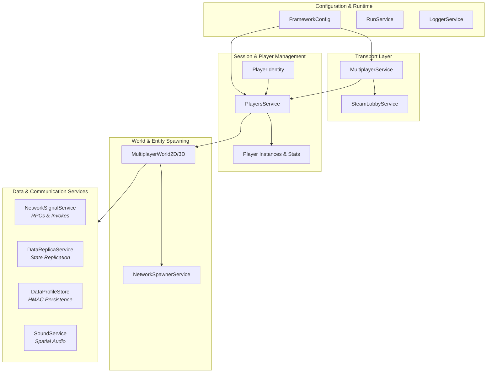

# Godot Multiplayer Framework

[](https://godotengine.org)
[](https://opensource.org/licenses/MIT)
[](#)
[](#)

A server-authoritative multiplayer framework engineered for Godot 4. Built to accelerate multiplayer game development, it features dual-transport networking (ENet & Steam P2P relay), state replication, session lifecycle management, dynamic RPC pipelines, HMAC-secured persistent storage, spatial audio, and automated spawn management.

---

## 🛠️ Key Design Decisions & Architecture Highlights

* **Decoupled Event Pipeline over Raw `@rpc`**: `NetworkSignalService` replaces scattered `@rpc` functions with dynamic string-identified event pipelines (`fire_server`, `fire_client`) and thread-safe async function calls (`invoke_server`), dramatically reducing node coupling.
* **Reactive Replicated State DTOs**: State synchronization utilizes path-based mutation listeners (`DataReplica`), ensuring minimal network overhead by broadcasting localized delta updates rather than full dictionary snapshots.
* **Tamper-Protected Persistence**: Player save states (`DataProfileStore`) incorporate HMAC SHA-256 signature verification and session-locking to prevent client-side save manipulation in P2P hosting models.
* **Strict Singleton Coordination**: Service dependencies are strictly defined to provide zero-boilerplate management of player joining sequences, host handshakes, and avatar scene bindings.

---

## 📊 Architecture & Layer Breakdown

| Layer | Primary Services | Responsibility & Core Capabilities |
| :--- | :--- | :--- |
| **Configuration & Runtime** | `FrameworkConfig`<br>`RunService`<br>`LoggerService` | Global constants, runtime environment checking (`is_server`, `is_client`), and level-filtered logging. |
| **Transport & Networking** | `MultiplayerService`<br>`SteamLobbyService` | Low-level socket management (ENet) and Steam P2P relay matchmaking. |
| **Identity & Sessions** | `PlayersService`<br>`PlayerIdentity`<br>`Player` / `PlayerStats` | Authoritative player registry, account identity resolution (Steam ID/UUID), and player stats. |
| **World & Spawning** | `MultiplayerWorld2D/3D`<br>`NetworkSpawnerService` | Spatial map management, dynamic entity instantiation, and automatic network replication. |
| **RPC & Event Pipeline** | `NetworkSignalService` | Decoupled event routing (`fire_server`, `fire_client`) and async two-way calls (`invoke_server`). |
| **State Replication** | `DataReplicaService`<br>`DataReplica` | Server-authoritative reactive state synchronization with path-based mutation listeners. |
| **Persistence & Utilities** | `DataProfileStore`<br>`DataProfile`<br>`GroupService`<br>`SoundService` | Session-locked storage with HMAC SHA-256 validation, node tagging, and 2D/3D spatial audio. |



---

## ⚠️ Required Setup: Autoload Singletons

> **CRITICAL:** **ALL 12 singletons listed below are mandatory.**
> The framework relies on interconnected dependencies. Omitting any singleton or changing their registration order **will result in startup initialization crashes**.

### Project Autoload Configuration
In Godot, navigate to **Project → Project Settings → Autoload (or Globals)** and register the scripts from `res://framework/singletons/` in this **exact order**:

| Order | Autoload Name | Script Path | Core Responsibility |
| :---: | :--- | :--- | :--- |
| **1** | `FrameworkConfig` | `res://framework/singletons/FrameworkConfig.gd` | Global parameters & enums |
| **2** | `RunService` | `res://framework/singletons/RunService.gd` | Environment detection (`is_server`, `is_client`) |
| **3** | `LoggerService` | `res://framework/singletons/LoggerService.gd` | Centralized level-based logger |
| **4** | `PlayerIdentity` | `res://framework/singletons/PlayerIdentity.gd` | Account ID & Steam ID resolution |
| **5** | `PlayersService` | `res://framework/singletons/PlayersService.gd` | Authoritative session player registry |
| **6** | `SteamLobbyService` | `res://framework/singletons/SteamLobbyService.gd` | Steam P2P match & lobby manager |
| **7** | `MultiplayerService` | `res://framework/singletons/MultiplayerService.gd` | ENet & Steam socket connection driver |
| **8** | `NetworkSpawnerService` | `res://framework/singletons/NetworkSpawnerService.gd` | Networked entity instantiation & tracking |
| **9** | `NetworkSignalService` | `res://framework/singletons/NetworkSignalService.gd` | Decoupled RPC & async event pipeline |
| **10** | `DataReplicaService` | `res://framework/singletons/DataReplicaService.gd` | Reactive state synchronization manager |
| **11** | `GroupService` | `res://framework/singletons/GroupService.gd` | Dynamic entity node tagging & tracking |
| **12** | `SoundService` | `res://framework/singletons/SoundService.gd` | Replicated 2D/3D spatial audio driver |

---

## 🛑 Disclaimers & Operational Requirements

* **Steam P2P Integration**: To host/join via Steam (`use_steam = true`), you must build your engine with **GodotSteam** or install the GodotSteam plugin in `res://addons/`, and place a valid `steam_appid.txt` in your project root.
* **Server Authority**: Logic enforcement must always occur on the server. Clients should request actions via `NetworkSignalService.fire_server()` or `invoke_server()` instead of mutating state locally.
* **Spawn Container Binding**: Always call `NetworkSpawnerService.set_spawn_container()` during map scene initialization so networked entities instantiate under the proper scene tree node. This can be bypassed if the scene inherits from MultiplayerWorld2D/3D.

---

## 🚀 Quick Start Guide

### 1. Configure Global Options
Set runtime behavior in `res://framework/singletons/FrameworkConfig.gd`:

```gdscript
# FrameworkConfig.gd
const MULTIPLAYER_MODE = MultiplayerMode.P2P
const LOG_LEVEL = LogLevel.DEBUG
const DATA_STORE_AUTO_SAVE_TIME = 15.0
```

### 2. Hosting a Game Session
Start an ENet host or Steam P2P relay lobby using `MultiplayerService`:

```gdscript
# Host an ENet server on port 7777 for up to 4 players
MultiplayerService.host_game(false, 7777, 4)

# Or host via Steam P2P Relay
MultiplayerService.host_game(true, 0, 4)
```

### 3. Joining a Game Session

```gdscript
# Connect via IP/Port
MultiplayerService.join_game(false, "127.0.0.1", 7777)

# Connect via Steam
MultiplayerService.join_game(true, "", 0)
```

### 4. Handling Player Connections

```gdscript
func _ready() -> void:
	PlayersService.player_added.connect(_on_player_added)

func _on_player_added(player: Player) -> void:
	LoggerService.info("Player joined: %s (Peer ID: %d)" % [player.name, player.peer_id])
```

### 5. Creating a Multiplayer Scene (MultiplayerWorld2D/3D)
To make any scene function as a multiplayer map, extend MultiplayerWorld in your level's root script. Do not edit framework core scripts directly!

1. Create a scene res://demo/Level1.tscn (Node3D or Node2D).

2. Add one or more Marker2D/3D nodes anywhere in the level tree as the player character spawn point(s).

3. Attach a script to the level root extending MultiplayerWorld2D/3D:

```gdscript
extends MultiplayerWorld2D # (or MultiplayerWorld3D)

func _ready() -> void:
	super._ready() # Scans for spawn points and binds player lifecycle hooks
	
	if RunService.is_server():
		LoggerService.info("Multiplayer world initialized successfully!")
```

### 6. Final Step
You MUST change these settings in `res://framework/singletons/FrameworkConfig.gd` according to your game's structure, otherwise players will be unable to load upon connection (unless `auto_spawn` of MultiplayerWorld2D/3D is disabled).
```gdscript
# FrameworkConfig.gd

## UID path to the main multiplayer world/game scene.
const MAIN_GAME_WORLD_PATH := ""

## UID path to the main menu UI scene.
const MAIN_MENU_PATH := ""

## Pre-cached registry of core framework scenes mapped to string keys.
const INITIAL_REGISTERED_SCENES: Dictionary[String, PackedScene] = {
	"player_character": preload("") # Change this to the game's player character scene
}
```

---

## 💻 Detailed Code Examples

### State Replication (`DataReplica`)
Manage server-authoritative reactive state synchronized across clients:

```gdscript
# SERVER: Create and replicate state DTO
if RunService.is_server():
	var party_state = DataReplicaService.create_replica("PartyState", {
		"Dungeon": "Crypts",
		"Members": ["Host"],
		"ReadyState": {"Host": true}
	})
	party_state.replicate()

# CLIENT OR SERVER: Attach listener to nested path changes
var party_replica = DataReplicaService.get_replica("PartyState")
if party_replica:
	party_replica.listen_to_change(["ReadyState"], func(new_val, old_val):
		print("Ready status changed: ", new_val)
	)

# SERVER: Mutate state (auto-broadcasts deltas)
party_replica.set_data(["ReadyState", "Peer2"], true)
party_replica.array_insert(["Members"], "Peer2")
```

### Dynamic Network Signals & Async Calls (`NetworkSignalService`)
Send non-blocking events or await server responses without defining manual `@rpc` methods:

```gdscript
# CLIENT: Fire a non-blocking event to the server
NetworkSignalService.fire_server("request_item_use", ["potion_health", 1])

# SERVER: Handle client event
NetworkSignalService.server_event_received.connect(
	func(event_name: String, player: Player, args: Array):
		if event_name == "request_item_use":
			print("Player %s requested %s" % [player.name, args[0]])
)

# SERVER: Bind a returnable async invocation
if RunService.is_server():
	NetworkSignalService.bind_server_invoke_callable("get_server_time", 
		func(player: Player, args: Array) -> Variant:
			return Time.get_unix_time_from_system()
	)

# CLIENT: Invoke server function asynchronously
func check_time() -> void:
	var server_time = await NetworkSignalService.invoke_server("get_server_time")
	print("Server Unix Time: ", server_time)
```

### Persistent Profile Storage (`DataProfileStore`)
Load and save player profiles with automatic HMAC SHA-256 tamper verification:

```gdscript
# SERVER: Initialize profile store node
var profile_store = DataProfileStore.new("PlayerData", {"Coins": 100, "Inventory": []})
add_child(profile_store)

func load_player_data(player: Player) -> void:
	var profile = await profile_store.load_profile(player.peer_id, "user_" + str(player.peer_id))
	if profile:
		profile.listen_to_change(["Coins"], func(new_val, old_val):
			print("Coins modified: ", new_val)
		)
		
		# Mutate profile data
		profile.set_data(["Coins"], profile.get_value(["Coins"], 100) + 50)
		
		# Save dirty profile to disk/client
		profile_store.save_profile(profile)
```

---

## 📖 API Reference Cheat Sheet

### `FrameworkConfig` (Autoload / Constants)
Global configuration file providing immutable framework constants and enum definitions.

#### Key Enums
* `MultiplayerMode`: `P2P` or `CENTRALIZED`
* `LogLevel`: `DEBUG`, `INFO`, `WARN`, `ERROR`, `NONE`

#### Key Settings
* `LOG_LEVEL`: Active logging threshold for `LoggerService`.
* `MULTIPLAYER_MODE`: Selected host topology (`P2P`).
* `PLAYER_AUTO_SPAWN`: Automatically handle character spawning (`true`).
* `PLAYER_RESPAWN_TIME`: Character respawn delay in seconds (`3.0`).
* `DATA_STORE_AUTO_SAVE_TIME`: Data persistence interval in seconds (`15.0`).


### `RunService` (Autoload / Singleton)
Utility service providing environment checks for networking roles and editor contexts.

#### Public API
* `is_server() -> bool`  
  Returns `true` if the process is running as a multiplayer server or in single-player offline mode.
* `is_client() -> bool`  
  Returns `true` if the process is running as a remote client peer.
* `is_editor() -> bool`  
  Returns `true` if executing within the Godot Editor.


### `LoggerService` (Autoload / Singleton)
Rich console logger utility with level-based filtering (`DEBUG`, `INFO`, `WARN`, `ERROR`).

#### Public API
* `debug(message: Variant) -> void`  
  Outputs gray `[DEBUG]` logs.
* `info(message: Variant) -> void`  
  Outputs cyan `[INFO]` logs.
* `warn(message: Variant) -> void`  
  Outputs yellow `[WARN]` logs and calls `push_warning()`.
* `error(message: Variant) -> void`  
  Outputs bold red `[ERROR]` logs and calls `push_error()`.

---

### `MultiplayerService` (Autoload / Singleton)
Session manager handling server hosting, client joining, Steam overlay fallbacks, and automatic scene transitions to the game world.

#### Key Signals
* `session_started()`: Fired when networking is established and scene transition begins.
* `session_failed(reason: String)`: Fired when server initialization or client connection fails.

#### Public API
* `host_game(use_steam: bool, port: int, max_players: int) -> void`  
  Hosts a game session using Steam or ENet socket binding.
* `join_game(use_steam: bool, address: String, port: int) -> void`  
  Connects to a target host address/port via ENet or delegates to Steam overlay invites.


### `SteamLobbyService` (Autoload / Singleton)
Steam lobby matchmaking manager utilizing `SteamMultiplayerPeer` for P2P relay networking.

#### Signals
* `host_created`: Fired when a host successfully establishes a Steam lobby.
* `client_joined`: Fired when a client joins an existing Steam lobby.

#### Constants
* `LOBBY_TYPE`: Default Steam privacy level (`LOBBY_TYPE_FRIENDS_ONLY`).
* `MAX_MEMBERS`: Maximum capacity for lobbies (`4`).

#### Public API
* `create_lobby() -> void`  
  Requests the Steam API to create a new lobby and sets up the server host peer.


### `PlayerIdentity` (Autoload / Singleton)
Unique player identity coordinator handling Steam ID resolution and isolated local UUID slot allocations for multi-instance debug testing.

#### Properties
* `player_id: String`: Resolved unique account identity string (e.g. `steam_76561198000000000` or `device_a1b2c3d4-...`).
* `use_static_instance_slots: bool`: If `true`, secondary debug editor instances retain fixed slot IDs (`player_id_slot_N.txt`) across restarts.


### `PlayersService` (Autoload / Singleton)
Authoritative session registry managing connected player state, Steam identity integration, character node binding, synchronized player statistics, and disconnect handshakes.

#### Key Signals
* `player_added(player: Player)`: Fired whenever a peer completes registration and joins the room.
* `player_removing(player: Player)`: Fired immediately before a player is removed or disconnected.
* `server_shutting_down()`: Fired when the session ends or connection to host drops.
* `player_stat_changed(player: Player, stat_name: String, value: Variant)`: Fired when a replicated stat changes.

#### Public API
* `setup_host_player() -> void`  
  *Server only.* Registers peer ID 1 as the session host.
* `notify_server_scene_ready() -> void`  
  *Client -> Server.* Sends player account identity and requests player spawn initialization.
* `get_players() -> Array[Player]`  
  Returns all currently active player instances in the session.
* `get_player_from_peer_id(peer_id: int) -> Player`  
  Returns the `Player` instance associated with a specific peer ID, or `null`.
* `get_player_from_character(char_node: Node) -> Player`  
  Looks up the owner `Player` given their spatial character node reference.
* `get_local_character() -> Node`  
  Returns the spatial character node belonging to `local_player`.
* `set_player_character(player: Player, char_node: Node) -> void`  
  *Server only.* Assigns a character node to a player and replicates the node path across all clients.
* `set_stat(player: Player, stat_name: String, value: Variant) -> void`  
  *Server only.* Modifies a player statistic and replicates it across all connected peers.
* `get_stat(player: Player, stat_name: String, default: Variant = 0) -> Variant`  
  Retrieves a replicated stat value for a target player.
* `kick_player(player: Player, reason: String) -> void`  
  *Server only.* Gracefully removes and disconnects a target player.
* `leave_server() -> void`  
  Voluntarily departs from the current session with a network flush buffer.


### `Player` (RefCounted)
Data model representing a player session, stats container, and character avatar lifecycle.

#### Signals
* `character_added(char_node: Node)`: Fired when an in-world avatar node is attached.
* `character_removing(char_node: Node)`: Fired before the current character node is detached.

#### Properties
* `peer_id: int`: Network unique peer ID.
* `name: String`: Display screen name.
* `stats: PlayerStats`: Container instance for player attributes and stats.
* `character: Node`: Reference to the active avatar node (triggers setter signals on change).


### `PlayerStats` (RefCounted)
KeyValue container for player stats and metrics with change signals.

#### Signals
* `stat_changed(stat_name: String, new_value: Variant)`: Fired when a stat is mutated.

#### Public API
* `set_value(stat_name: String, value: Variant) -> void`  
  Assigns a value to a stat key and emits `stat_changed`.
* `get_value(stat_name: String, default: Variant = 0) -> Variant`  
  Retrieves a stat value with a fallback default.
* `has_stat(stat_name: String) -> bool`  
  Returns `true` if the statistic key exists in storage.

---

### `MultiplayerWorld2D/3D` (Node2D / Node3D)
An inheritable class for multiplayer maps, controlling spawn positioning, character instantiation, respawns, and disconnection transitions.

#### Properties
* `auto_spawn: bool`: Toggles automatic avatar spawning on player join and death.
* `respawn_time: float`: Delay in seconds before a destroyed player avatar respawns.

#### Public API
* `spawn_player_character(player: Player) -> void`  
  *Server only.* Instantiates, parents, and replicates a player's character node at a random `PlayerCharacterSpawnPoint`.
* `force_reposition(player: Player, target_position: Variant) -> void`  
  *Server only.* Overrides a client's character position via targeted RPC.


### `NetworkSpawnerService` (Autoload / Singleton)
Dynamic networked object spawner managing scene registration and `MultiplayerSpawner` replication.

#### Public API
* `set_spawn_container(container: Node) -> void`  
  Sets the root target node where replicated networked entities will be parented.
* `register_scene(scene_key: String, scene: PackedScene) -> void`  
  Registers a scene resource dynamically at runtime for network spawning.
* `instantiate_entity(scene_key: String, transform_data: Variant = null) -> Node`  
  Creates a node instance on the server without replicating it immediately to clients.
* `replicate_entity(instance: Node, custom_parent: Node = null) -> void`  
  Parents an instantiated entity under the spawn container, triggering automatic network replication.
* `spawn(scene_key: String, transform_data: Variant = null, custom_parent: Node = null) -> Node`  
  *One-line shortcut.* Instantiates, positions, and replicates a scene instance immediately.

---

### `NetworkSignalService` (Autoload / Singleton)
Abstraction of RPC to support dynamic pipeline enabling string-identified client-server event routing and two-way function invocations.

#### Key Signals
* `server_event_received(event_name: String, player: Player, args: Array)`: Fired on the server when a client calls `fire_server`.
* `client_event_received(event_name: String, args: Array)`: Fired on a client when the server calls `fire_client` or `fire_all_clients`.

#### Public API
* `fire_server(event_name: String, args: Array = []) -> void`  
  *Client -> Server.* Sends a non-blocking event to the server.
* `fire_client(target: Variant, event_name: String, args: Array = []) -> void`  
  *Server -> Client.* Sends a non-blocking event to a target `Player` or peer ID.
* `fire_all_clients(event_name: String, args: Array = []) -> void`  
  *Server -> All Clients.* Broadcasts a non-blocking event to all connected peers.
* `bind_server_invoke_callable(function_name: String, callable: Callable) -> void`  
  *Server only.* Registers a function handler `func(player: Player, args: Array) -> Variant`.
* `invoke_server(function_name: String, args: Array = [], timeout: float = 5.0) -> Variant`  
  *Client -> Server.* Calls a server function and `await`s its return value with automatic timeout handling.

---

### `DataReplicaService` (Autoload / Singleton)
Server-authoritative state synchronization manager handling creation, network targeting, mutation streaming, and lifecycle tracking of reactive data structures (`DataReplica`).

#### Key Signals
* `replica_created(replica: DataReplica)`: Fired when a new replica registers locally (server or client).

#### Public API
* `create_replica(r_name: String, initial_data: Dictionary, tags: Dictionary = {}) -> DataReplica`  
  *Server only.* Instantiates and registers a new state replica.
* `get_replica(r_name: String) -> DataReplica`  
  Retrieves an active replica by string key, returning `null` if not found.


### `DataReplica` (RefCounted)
State container for network-replicated state dictionaries managed by `DataReplicaService`.

#### Signals
* `data_set(path: Array, new_value: Variant, old_value: Variant)`: Fired on key path mutation.
* `array_inserted(path: Array, value: Variant, index: int)`: Fired on array insertion.
* `array_removed(path: Array, removed_value: Variant, index: int)`: Fired on array removal.
* `destroyed()`: Fired when replica is destroyed across network.

#### Public API
* `replicate() -> void`  
  *Server only.* Replicates state globally to all current and future peers.
* `subscribe(peer_id: int) -> void`  
  *Server only.* Subscribes a specific client peer to receive state updates.
* `unsubscribe(peer_id: int) -> void`  
  *Server only.* Unsubscribes a specific client peer.
* `listen_to_change(path: Array, callback: Callable) -> void`  
  Attaches a callback listener for changes at a specific key path.
* `set_data(path: Array, value: Variant) -> void`  
  Mutates value at path and replicates mutation across network if server.
* `array_insert(path: Array, value: Variant, index: int = -1) -> void`  
  Inserts item into array path and replicates.
* `array_remove(path: Array, index: int) -> Variant`  
  Removes item from array path by index and replicates.
* `destroy() -> void`  
  Destroys replica across server and connected clients.


### `DataProfileStore` (Node)
Manager for profile sessions, file persistence, HMAC tamper protection, and multiplayer RPC data transfer.

#### Enums
* `StoreMode`: `P2P` (client file authority + HMAC) or `CENTRALIZED` (server/database authority).

#### Signals
* `profile_loaded(profile: DataProfile)`: Fired when a profile session is active.
* `profile_unloaded(profile: DataProfile)`: Fired when a profile session is closed.
* `client_payload_received(key: String)`: Fired when host receives client save package.

#### Public API
* `load_profile(peer_id: int, key: String, timeout: float = 5.0) -> DataProfile`  
  *Server only.* Asynchronously loads a profile for a target peer and locks it in memory.
* `save_profile(profile: DataProfile) -> void`  
  *Server only.* Saves profile changes to disk or remote client if marked dirty.
* `unload_profile(profile: DataProfile) -> void`  
  *Server only.* Saves, unlocks, and evicts an active profile from memory.
* `save_all() -> void`  
  *Server only.* Commits all active loaded profiles to persistent storage.


### `DataProfile` (RefCounted)
State wrapper for nested dictionaries supporting path manipulation, listeners, and template reconciliation.

#### Signals
* `data_set(path: Array, new_value: Variant, old_value: Variant)`: Fired on key mutation.
* `array_inserted(path: Array, value: Variant, index: int)`: Fired on array insertion.
* `array_removed(path: Array, removed_value: Variant, index: int)`: Fired on array removal.
* `unlocked()`: Fired when session active status releases.

#### Public API
* `listen_to_change(path: Array, callback: Callable) -> void`  
  Attaches a callback to listen for state changes at or under a given path.
* `unlisten_change(path: Array, callback: Callable) -> void`  
  Detaches a path callback.
* `set_data(path: Array, value: Variant) -> void`  
  Mutates a value at a specific path array (e.g., `["Stats", "Coins"]`).
* `array_insert(path: Array, value: Variant, index: int = -1) -> void`  
  Inserts an element into an array path.
* `array_remove(path: Array, index: int) -> Variant`  
  Removes and returns an element at index from an array path.
* `is_dirty() -> bool`  
  Returns `true` if profile state has uncommitted changes.

---

### `GroupService` (Autoload / Singleton)
Dynamic entity and node tagging manager providing lifecycle tracking and reactive addition/removal signals.

#### Key Signals
* `node_added(group_name: String, node: Node)`: Fired when a node is added to a group.
* `node_removed(group_name: String, node: Node)`: Fired when a node is removed from a group or exits the tree.

#### Public API
* `add_group(node: Node, group_name: String) -> void`  
  Tags a node with a group string, tracks its tree exit lifecycle, and emits `node_added`.
* `remove_group(node: Node, group_name: String) -> void`  
  Strips a group tag from a node and emits `node_removed`.
* `in_group(node: Node, group_name: String) -> bool`  
  Returns `true` if the node is valid and assigned to the specified group.
* `get_group_nodes(group_name: String) -> Array[Node]`  
  Retrieves all active scene tree nodes currently belonging to `group_name`.


### `SoundService` (Autoload / Singleton)
Global audio playback manager providing 2D/3D local playback and server-authoritative sound replication.

#### Public API
* `play_sound_2d(stream_or_key: Variant, volume_db: float = 0.0) -> void`  
  Plays a 2D non-spatial sound locally by AudioStream object or registered sound key.
* `play_sound_3d(stream_or_key: Variant, global_pos: Vector3, volume_db: float = 0.0) -> void`  
  Plays a 3D spatial sound locally at a specific world coordinate.
* `play_sound_3d_replicated(sound_key: String, global_pos: Vector3, volume_db: float = 0.0) -> void`  
  *Server only.* Replicates a 3D spatial sound to all clients at a target world position.
* `play_sound_2d_replicated(sound_key: String, volume_db: float = 0.0) -> void`  
  *Server only.* Replicates a 2D sound globally to all connected clients.
* `play_sound_2d_client(target: Variant, sound_key: String, volume_db: float = 0.0) -> void`  
  *Server only.* Replicates a 2D sound targeted to a specific `Player` or peer ID.

---

## 📁 Repository Folder Structure

```
res://
├── addons/                    # Optional editor plugins (e.g., GodotSteam)
├── demo/                      # Example playable demo scene & integration showcases
└── framework/                 # Core Framework Package
    ├── objects/               # Reference-counted data models & helper nodes
    └── singletons/            # Mandatory Autoload Singletons
```

---

## 🤝 Contributing

Contributions, feature requests, and bug reports are welcome! 

1. Fork the Repository
2. Create a Feature Branch (`git checkout -b feature/NewFeature`)
3. Commit your Changes (`git commit -m 'Add NewFeature'`)
4. Push to the Branch (`git checkout origin feature/NewFeature`)
5. Open a Pull Request

---

## 📄 License

Distributed under the **MIT License**. See `LICENSE` for details.
